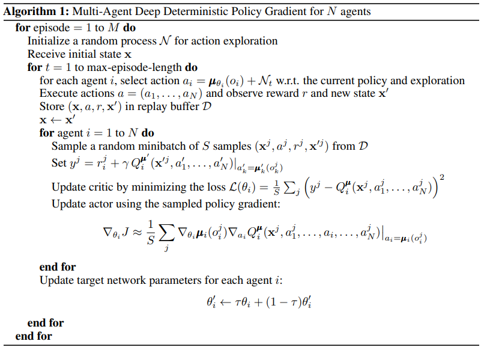
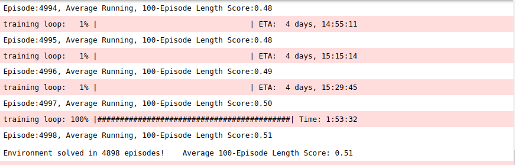
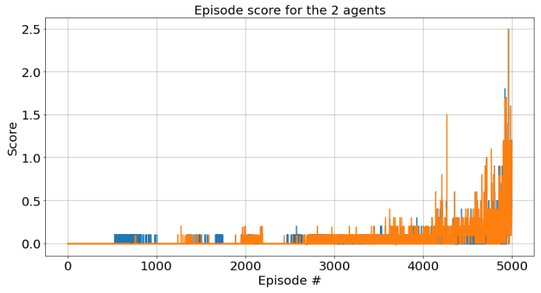

# Prepare For Trouble. Make It Double!

## Project Objective

In this project, **the objective is to train a pair of agents (two tennis rackets) to keep the ball in play. The goal of the agents is to hit the ball back and forth, without the ball hitting the floor, for as many time steps as possible.**


## Environment details

In this environment, two agents control rackets to bounce a ball over a net. If an agent hits the ball over the net, it receives a reward of +0.1. If an agent lets a ball hit the ground or hits the ball out of bounds, it receives a reward of -0.01. Thus, the goal of each agent is to keep the ball in play.

The observation space consists of 8 variables corresponding to the position and velocity of the ball and racket. Each agent receives its own, local observation. Two continuous actions are available, corresponding to movement toward (or away from) the net, and jumping.

- Set-up: Two-player game where agents control rackets to hit a ball over the
  net.
- Goal: The agents must hit the ball so that the opponent cannot hit a valid
  return.
- Agents: The environment contains two agent with same Behavior Parameters.
  After training you can set the `Behavior Type` to `Heuristic Only` on one of
  the Agent's Behavior Parameters to play against your trained model.
- Agent Reward Function (independent):
  - +1.0 To the agent that wins the point. An agent wins a point by preventing
    the opponent from hitting a valid return.
  - -1.0 To the agent who loses the point.
- Behavior Parameters:
  - Vector Observation space: 9 variables corresponding to position, velocity
    and orientation of ball and racket.
  - Vector Action space: (Continuous) Size of 3, corresponding to movement
    toward net or away from net, jumping and rotation.
  - Visual Observations: None
- Float Properties: Three
  - gravity: Magnitude of gravity
    - Default: 9.81
    - Recommended Minimum: 6
    - Recommended Maximum: 20
  - scale: Specifies the scale of the ball in the 3 dimensions (equal across the
    three dimensions)
    - Default: .5
    - Recommended Minimum: 0.2
    - Recommended Maximum: 5
- Benchmark Mean Reward: 30

The task is episodic, and in order to solve the environment, your agents must get an average score of +0.5 (over 100 consecutive episodes, after taking the maximum over both agents). Specifically,

- After each episode, we add up the rewards that each agent received (without discounting), to get a score for each agent. This yields 2 (potentially different) scores. We then take the maximum of these 2 scores.
- This yields a single **score** for each episode.

The environment is considered solved, when the average (over 100 episodes) of those scores is at least +0.5.

## Agent Implementation

### MADDPG 

This project implements a *Policy Based* method called Multi-Agent Deep Deterministic Policy Gradient [MADDPG](https://arxiv.org/abs/1706.02275). 
> ABSTRACT: We explore deep reinforcement learning methods for multi-agent domains. We begin by analyzing the difficulty of traditional algorithms in the multi-agent case: Q-learning is challenged by an inherent non-stationarity of the environment, while policy gradient suffers from a variance that increases as the number of agents grows. We then present an adaptation of actor-critic methods that considers action policies of other agents and is able to successfully learn policies that require complex multiagent coordination. Additionally, we introduce a training regimen utilizing an ensemble of policies for each agent that leads to more robust multi-agent policies. We show the strength of our approach compared to existing methods in cooperative
as well as competitive scenarios, where agent populations are able to discover various physical and informational coordination strategies.

Multi-Agent Deep Determininistic Policy Gradient leverages a number techniques:
- A Reinforcement Learning method for continuous-action spaces
- Q-table approximation (action-values) using a Deep Neural Network (the Actor)
- An action estimation (action to take) using a Deep Neural Network (the Critic)
- Multiple Agents each with their own Actor and Critic Networks

This implementation includes other training improvements: 
- Experience Replay
- Fixed Q Targets
- Soft Updates
- Ornstein-Unlenbeck Process

### Algorithm



This algorithm is taken from the [Multi-Agent Deep Deterministic Policy Gradient algorithm from "Multi-Agent Actor-Critic for Mixed Cooperative-Competitive Environments](https://arxiv.org/abs/1706.02275).

### Code implementation

The code is based on the "DRL_Continuous_Control" repository from the [Deep Reinforcement Learning Continuous Control](https://github.com/stingram/DRL_Continuous_Control), and has been modified to solve the multi-agent problem in the Tennis environment.

Relevant files include:
- Tennis.ipynb : This Jupyter notebook file is the main driver to allow agent training. It does the following:
  - Imports necessary packages 
  - Examines the state and action spaces
  - Takes Random Actions in the Environment
  - Trains both tennis agents using MADDPG
  - Saves the actor model and critic model for each agent when target score is achieved
  - Plot the scores
  - Saves the scores
  
- model.py : This file defines two PyTorch classes, the Actor network and the Critic network. 

	- The Actor network is a fully connected Deep Neural Network using the [PyTorch Framework](https://pytorch.org/docs/0.4.0/). This network is trained to predict the action to perform depending on the environment observed states. This Neural Network is used by the DDPG agent and is composed of:
	  - the input layer, its size is equal to the state_size parameter passed into the constructor
	  - Two hidden fully connected layers, one with 64 cells and the second with 32 cells
	  - The output layer which size is set to the action_size parameter passed in the constructor
	  - The final activation is tanh
	  
	- The Critic network is also fully connected Deep Neural Network using the [PyTorch Framework](https://pytorch.org/docs/0.4.0/). This network is trained to predict the Q-values depending on the environment observed states and the action prediction from the Actor network. This Neural Network is used by the DDPG agent and is composed of:
	  - the input layer, its size is equal to the state_size parameter passed into the constructor
	  - Three hidden fully connected layers, one with 64 cells, the second with 32 cells, and the third with 16 cells.
	  - The output from the first fully connected layer is passed through a ReLU activation and concatenated with the action from the Actor network such that the number of inputs to the second hidden layer is the size of the output from the first hidden layer plus the size of the action from the Actor network.
	  - The output layer which size is 1, which is the estimated Q-value.
  
- ddpg_agent.py : This file defines a DDPG agent, and an Ornstein-Uhlenbeck process and a Replay Buffer memory, both used by the each DDPG agent. 
  - The DDPG agent class is implemented, as described in the Multi-Agent Deep Deterministic Policy Gradient algorithm. It provides several methods:
    - constructor: 
      - Initialize the memory buffer (*Replay Buffer*)
      - Initialize two instances of both the Actor neural network and Critic neural network defined in model.py : the *target* network and the *local* network
	  - Initialize the Ornstein-Uhlenbeck noise process
    - step function: 
      - Allows to store a step taken by the agent (state, action, reward, next_state, done) in the Replay Buffer/Memory
	  - Every step, updates the Actor's and Critic's *target* network weights with the current weight values from the respective *local* network.
    - act function: returns the actions for the given state given under by the current policy. Action selection is done by using the output of the Actor *local* Network, given the current observed state with a decayed noise sample from the Ornstein-Uhlenbeck process.
    - learn function: First, the Critic's *local* network parameters are updated using a given batch of experiences from the replay buffer. This is accomplished by computing Q-values from the Critic's *target* network and the Q-values from the Critic's *local* network. The mean square error between between these Q-values are the critic loss. Next, the Actor *local* network parameters are updated using the negative of the mean of the output of the Critic *local* network, given observed states and the actions predicted by the Actor *local* network. 
    - soft_update function is called by learn() to update the *target* neural network parameters with a weighted combination of the *local* network weights and *target* network weights.
  - The ReplayBuffer class implements a fixed-size buffer to store experience tuples  (state, action, reward, next_state, done) 
    - add function adds an experience step to the memory
    - sample function randomly samples a batch of experience steps for the learning       

### MADDPG Parameters Values, Model Architectures and Results

Each DDPG agent uses the following parameters values (defined in ddpg_agent.py):

```
BUFFER_SIZE = int(1e6)  # Replay buffer size
BATCH_SIZE = 1024       # Minibatch size 
GAMMA = 0.99            # Discount factor 
TAU = 1e-3              # For soft update of target parameters
LR_ACTOR = 1e-4         # Learning rate for actor network
LR_CRITIC = 1e-3		# Learning rate for the critic network
WEIGHT_DECAY = 0		# L2 Regularization
UPDATE EVERY = 1		# How often to update the network
UPDATE_TIMES = 1        # How many times to update the network
NOISE_DECAY  = 0.999    # Noise decay factor
```

The Actor Neural Networks use the following architecture:

```
Input nodes (24) -> Fully Connected Layer (64 nodes, Relu activation) -> Fully Connected Layer (32 nodes, Relu activation) -> Ouput nodes (2)
```

The Actor networks use Adam optimization with a learning rate of LR=1e-4 and are trained using a BATCH_SIZE=1024.

The Critic Neural Networks use the following architecture:

```
Input nodes (24) -> Fully Connected Layer (64 nodes, Relu activation) -> Fully Connected Layer (32 nodes, Relu activation) -> Fully Connected Layer (16 nodes, Relu activation) -> Ouput nodes (1)
```

The networks use Adam optimization with a learning rate of LR=1e-3 and are trained using a BATCH_SIZE=1024.

With the given architecture and parameters, the training logs and results are shown below:





**These results meets the project's expectation as the agents are able to receive an average reward (over 100 episodes) of at least +0.5, and in fewer than 5000 episodes. The problem was considered solved after Episode 4898.**

### Ideas for Future Work

Training the agent with different hyper-parameters, such as the  parameters of each of actor and critic network, including adding dropout layers, changing activation functions, batch size, discount factor and update frequency could lead to improved performance, as well as faster convergence. Furthermore, other techniques, like using a prioritized experience replay could be imeplemented to improve performance:

- [Prioritized experience replay](https://arxiv.org/abs/1511.05952)
> ABSTRACT: Experience replay lets online reinforcement learning agents remember and reuse experiences from the past. In prior work, experience transitions were uniformly sampled from a replay memory. However, this approach simply replays transitions at the same frequency that they were originally experienced, regardless of their significance. In this paper we develop a framework for prioritizing experience, so as to replay important transitions more frequently, and therefore learn more efficiently. We use prioritized experience replay in Deep Q-Networks (DQN), a reinforcement learning algorithm that achieved human-level performance across many Atari games. DQN with prioritized experience replay achieves a new state-of-the-art, outperforming DQN with uniform replay on 41 out of 49 games.

### Training Hardware Configuration 

The agents were trained on an Nvidia Titan X 12GB GPU. The Unity environment without visualization was used during training.